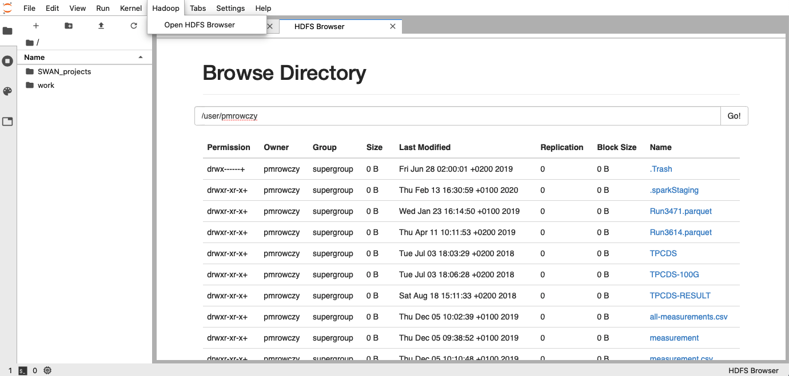

# HdfsBrowser

Hadoop JupyterLab Extension

This extension is composed of a Python package named `hdfsbrowser`, which installs the server+nbextension and a NPM package named `@swan-cern/hdfsbrowser`
for the JupyterLab extension.



## Requirements

* JupyterLab >= 2.1

## Install

Note: You will need NodeJS to install the extension.

```bash
pip install hdfsbrowser
jupyter nbextension install hdfsbrowser --py
jupyter nbextension enable  hdfsbrowser --py
jupyter lab build
```

## Configure extension to work with Hadoop cluster through hdfs-site.xml

Configure notebook `jupyter_notebook_config.py`:

```
c.HDFSBrowserConfig.hdfs_site_path = "/cvmfs/sft.cern.ch/lcg/etc/hadoop-confext/conf/etc/analytix/hadoop.analytix/hdfs-site.xml"
c.HDFSBrowserConfig.hdfs_site_namenodes_property = "dfs.ha.namenodes.analytix"
c.HDFSBrowserConfig.hdfs_site_namenodes_port = "50070"
c.HDFSBrowserConfig.webhdfs_token = "dummy"
```

## Troubleshoot

If you are not seeing the frontend, check if it's installed:

```bash
jupyter labextension list
```

If it is installed, try:

```bash
jupyter lab clean
jupyter lab build
```

## Contributing

### Install

The `jlpm` command is JupyterLab's pinned version of
[yarn](https://yarnpkg.com/) that is installed with JupyterLab. You may use
`yarn` or `npm` in lieu of `jlpm` below.

```bash
# Clone the repo to your local environment
# Move to hdfsbrowser directory

# Install server extension
# This will also build the js code
pip install -e .

# Install and enable the nbextension
jupyter nbextension install hdfsbrowser --py --sys-prefix
jupyter nbextension enable  hdfsbrowser --py --sys-prefix

# Link your development version of the extension with JupyterLab
jupyter labextension link .
# Rebuild JupyterLab after making any changes
jupyter lab build

# Rebuild Typescript source after making changes
jlpm build
# Rebuild JupyterLab after making any changes
jupyter lab build
```

You can watch the source directory and run JupyterLab in watch mode to watch for changes in the extension's source and automatically rebuild the extension and application.

```bash
# Watch the source directory in another terminal tab
jlpm watch
# Run jupyterlab in watch mode in one terminal tab
jupyter lab --watch
```

### Uninstall

```bash
pip uninstall hdfsbrowser
jupyter labextension uninstall @swan-cern/hdfsbrowser
```
