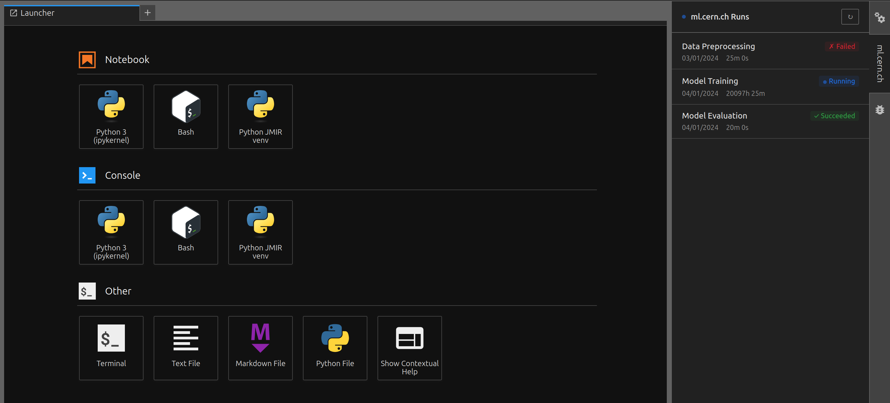

# swan-ml

JupyterLab sidebar extension showing [ml.cern.ch](https://ml.cern.ch)
pipeline run status in real-time.



## Installation

```bash
pip install swan-ml
```

### Development

```bash
# Install and build
pip install -e ".[dev]"

# Or install and build manually
jlpm install
jlpm build
jupyter labextension develop --overwrite .

# Watch for changes (in a separate terminal)
jlpm watch
```
